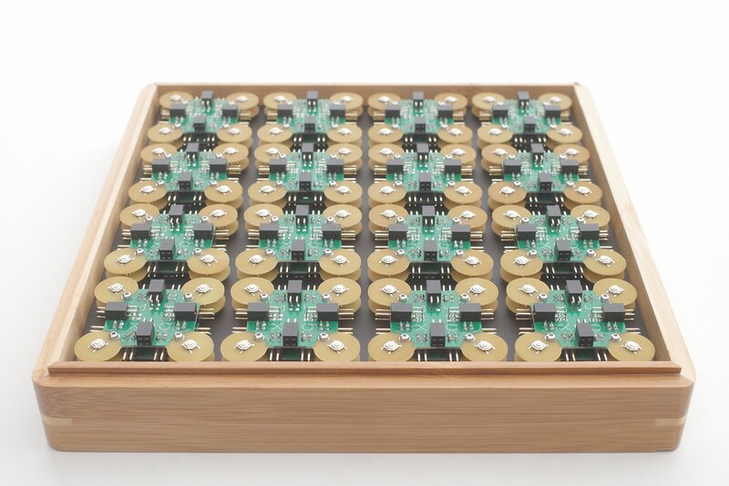
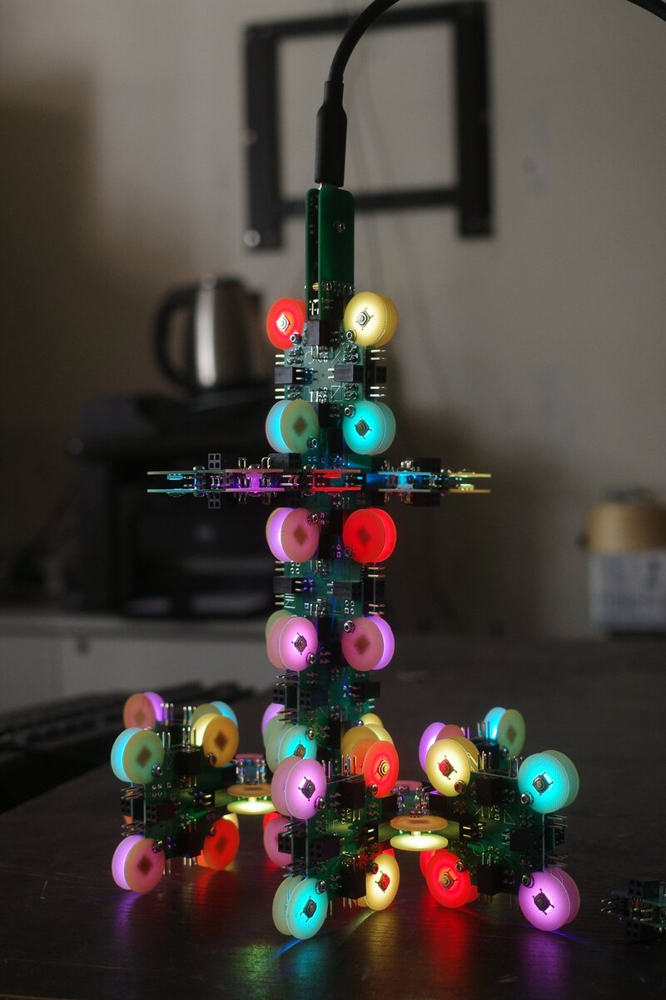
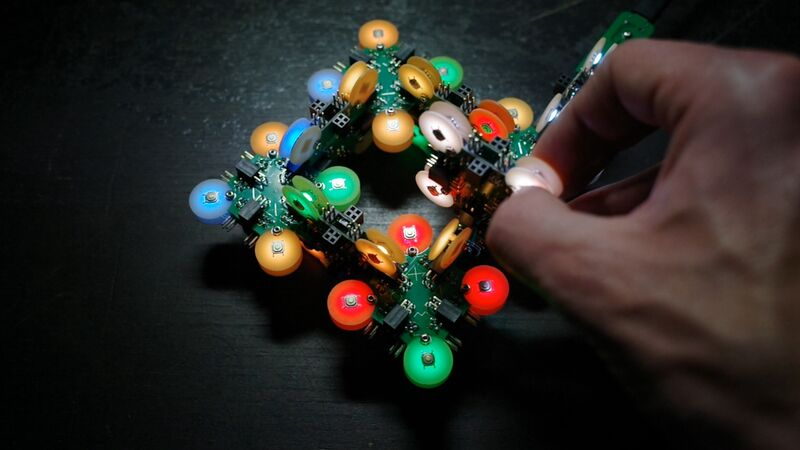

Introduction
============

A-to-M is an experimental construction system: Atoms (*A*) are
assembled *to* form molecules (*M*).

A molecule is powered with a USB-C adapter. This adapter is also used
to program individual atoms.

Design guidelines
=================

For areas without solder mask, don’t use components smaller than 0603
and don’t put traces too close. A clearance of 0.35 mm is good.

MiniCore
========

For a good experience, i.e. fast power up of an atom upon connection,
install [MiniCore][1] as boot loader.

Examples
========

Atomic tree
-----------

Sequencer
---------

[][2]  
[Video][1]

License
=======

Except where noted otherwise, files are licensed under the WTFPL.

Copyright © 2020 [Felix E. Klee](felix.klee@inka.de)

This work is free. You can redistribute it and/or modify it under the
terms of the Do What The Fuck You Want To Public License, Version 2,
as published by Sam Hocevar. See the COPYING file for more details.

[1]: https://github.com/MCUdude/MiniCore
[2]: https://archive.org/details/a-to-m-sequencer
