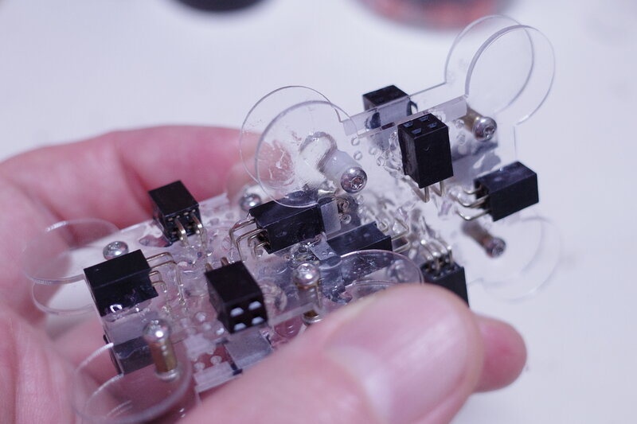

A-to-M is an experimental construction system for assembling electric
structures.

Atoms – *A* – are assembled *to* form molecules – *M*.

Design guidelines
=================

For areas without solder mask, don’t use components smaller than 0603.

License
=======

Except where noted otherwise, files are licensed under the WTFPL.

Copyright © 2020 [Felix E. Klee](felix.klee@inka.de)

This work is free. You can redistribute it and/or modify it under the
terms of the Do What The Fuck You Want To Public License, Version 2,
as published by Sam Hocevar. See the COPYING file for more details.
